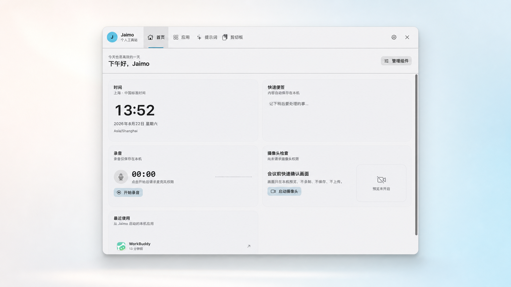
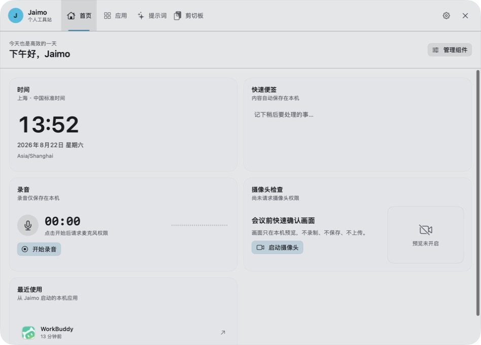
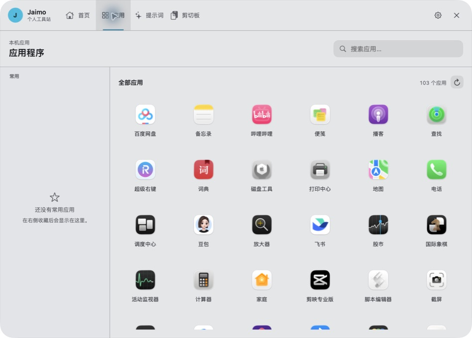

<p align="center">
  
</p>

<h1 align="center">Jaimo clip</h1>

<p align="center">
  原生、本地优先的 macOS 个人工具站
</p>

<p align="center">
  <a href="https://github.com/Jaimo-so/Jaimo-clip/releases/latest"></a>
  
  
  <a href="LICENSE"></a>
</p>

<p align="center">
  <a href="https://github.com/Jaimo-so/Jaimo-clip/releases/latest"><strong>下载最新版本</strong></a>
</p>

<p align="center">
  
</p>

Jaimo clip 把常用的本机操作收进一个由 `⌥Space` 直接唤起的工具站：首页提供时间、快速便签、本地录音、摄像头检查和最近应用；应用页集中搜索、收藏并启动本机应用；提示词与剪切板页面负责管理长期复用的模板和临时内容。

所有剪切板记录、图片、提示词、便签和录音均保存在本机。应用无需账户，不依赖云同步，不包含 Electron、WebView 或 AI 运行时；界面和核心能力均使用 Swift、SwiftUI、AppKit 与 macOS 系统框架实现。

> 当前公开版本：`0.5.0`。支持 macOS 13 或更高版本，仅提供 Apple Silicon（M1/M2/M3/M4 及后续芯片）安装包，不提供 Intel（x86_64）版本。

## 产品展示

| 可组合首页 | 本机应用启动台 |
| --- | --- |
|  |  |

首页组件可以排序和隐藏。录音只在用户主动开始后请求麦克风权限，文件保存在本机；摄像头画面只做实时预览，不录制、不保存、不上传。应用启动台扫描本机应用目录，收藏和最近启动记录同样只保存在本机。

产品设计语言记录在 `DESIGN.md`。`jaimo-island-handoff-spec.md` 保留了工具站早期交互方案和设计演进；旧版剪贴板视图的视觉与实现资料继续保留在 `clipflow-app.html` 和 `clipflow-handoff-spec.md`，用于追踪兼容行为。

## 下载与安装

1. 从 [GitHub Releases](https://github.com/Jaimo-so/Jaimo-clip/releases/latest) 下载名称以 `-macOS-Apple-Silicon.dmg` 结尾的安装包。
2. 双击打开 DMG。
3. 将 `Jaimo clip.app` 拖到镜像中的 `Applications` 快捷入口。
4. 从“应用程序”文件夹启动 Jaimo clip。启动后会立即显示主面板，并在菜单栏常驻。

当前公开安装包使用临时代码签名，尚未使用 Apple Developer ID 公证。其他 Mac 首次打开时可能被 Gatekeeper 阻止；请前往“系统设置 → 隐私与安全性”，在安全提示旁选择“仍要打开”，随后确认一次。不要从非本仓库 Release 的第三方地址下载安装包。

如需验证下载是否完整，将同一 Release 中的 `.dmg` 与 `.dmg.sha256` 放在同一目录后执行：

```bash
shasum -a 256 -c Jaimo-clip-0.5.0-macOS-Apple-Silicon.dmg.sha256
```

## 当前能力

- 使用 `⌥Space` 从隐藏态直接打开完整工具站，不经过额外的中间界面；再次触发快捷键、点击窗口外部、点击关闭按钮或按 `Escape` 可隐藏
- 首页包含时间、快速便签、本地录音、摄像头检查和最近使用应用，组件支持排序、隐藏和恢复
- 录音支持开始、暂停、继续、完成、实时音量反馈和在访达中定位；M4A 文件只保存在本机 Application Support 目录
- 摄像头只进行本机实时预览，用于会议前检查画面，不录制、不保存、不上传
- 应用页扫描 `/Applications`、`/System/Applications` 和 `~/Applications`，支持搜索、收藏、启动和最近使用记录
- 每 0.4 秒读取 `NSPasteboard.changeCount`，自动记录文字、代码、HTTP(S) 链接和图片
- 支持直接复制的 PNG/JPEG 像素数据，也支持从 Finder、飞书等应用复制 JPG/JPEG、PNG 等本地图片文件；文件引用会读取真实图片内容，不会误存为文件图标
- 设置页和菜单栏支持检查更新；发现 GitHub Release 新版本后，可一键下载、校验、安装并自动重新启动
- 使用 Carbon 注册全局 `⌥Space`，通过不激活原应用的浮动 `NSPanel` 展示历史
- 支持搜索、全部/文字/图片/链接/收藏分类、键盘导航、复制回剪贴板、收藏和删除
- 内置独立的本地提示词库，支持分组、搜索、收藏、新建、编辑、删除和使用次数记录
- 可将文字、代码或链接历史保存为提示词；使用 `{{变量名}}` 定义调用时填写的模板变量
- 长文本预览按片段渐进渲染，首屏只排版开头内容，滚动到底部后继续加载后续片段
- 连续相同内容按 SHA-256 去重；自身写回剪贴板产生的 change count 会被忽略
- 历史上限为 150 条，超出后淘汰最旧的非收藏项，收藏项保留
- SQLite 只保存元数据和图片路径；图片文件独立保存在本机 Application Support 目录
- 默认排除 1Password、钥匙串访问和终端，可在 `⌘,` 偏好设置中移除
- 清空历史需要在 8 秒内进行第二次确认
- 跟随系统浅色/深色外观，并支持系统“减弱动态效果”设置

## 使用说明

首次启动会直接显示完整工具站；后续登录启动保持隐藏。应用已在后台运行时，再次双击会重新显示工具站。菜单栏图标左键显示或隐藏完整工具站，右键可以显示工具站、检查更新或退出应用。

快捷键：

- `⌥Space`：直接显示或隐藏完整工具站
- `↑` / `↓`：移动选中项
- `↵`：复制选中项到系统剪贴板
- `⌘F`：聚焦搜索
- `⌘1` / `⌘2` / `⌘3` / `⌘4`：切换首页 / 应用 / 提示词 / 剪切板
- `⌘N`：新建提示词
- `⌘E`：编辑选中的提示词
- `⌘S`：切换收藏
- `⌘⌫`：删除选中项
- `⌘,`：打开或关闭偏好设置
- `ESC`：先清空搜索，再关闭面板

开机自动启动需要应用位于 `/Applications`。在 Jaimo clip 偏好设置中开启相应选项即可。

## 隐私与本机数据

Jaimo clip 不上传剪贴板内容，不要求账户，也没有云同步。链接首版不抓取网页标题，避免让复制行为产生隐式网络请求。只有“检查更新”功能会访问本仓库的 GitHub Release API 和下载安装包。

为保证从旧版 ClipFlow 升级后不丢失记录，应用继续使用原有的内部应用标识 `com.clipflow.mac` 和数据目录：

```text
~/Library/Application Support/ClipFlow/
├── ClipFlow.sqlite3      # 剪贴板历史、提示词、应用启动记录等本机数据
├── Images/               # 剪切板图片
└── Recordings/           # 用户主动创建的 M4A 录音
```

删除应用不会自动删除上述本地数据。偏好设置中的“清空历史”只删除剪贴板历史，不会删除提示词库；如需彻底移除全部数据，需要退出应用后删除该目录。

## 应用内更新

应用每 24 小时最多自动检查一次，也可以在偏好设置或菜单栏中手动检查。更新源由 `Resources/Info.plist` 的 `ClipFlowUpdateRepositoryOwner` 和 `ClipFlowUpdateRepositoryName` 定义，当前为 `Jaimo-so/Jaimo-clip`。

每个 GitHub Release 需要满足以下契约，否则应用会拒绝一键安装：

- Release 标签使用可比较版本号，例如 `v0.3.1`
- Apple Silicon 安装包名称以 `-macOS-Apple-Silicon.dmg` 结尾
- Release 资产包含 GitHub 提供的 `sha256:` digest，或同时上传与 DMG 同名并追加 `.sha256` 的校验文件
- DMG 根目录包含 `Jaimo clip.app`；为兼容旧包，更新器也能识别 `ClipFlow.app`
- 应用标识必须为 `com.clipflow.mac`
- 应用版本必须与 Release 标签一致，可执行文件必须包含 `arm64` 架构，代码签名必须有效

下载使用 HTTPS；安装前会验证 SHA-256、应用标识、版本、架构和代码签名。更新助手会先备份当前应用，替换失败时恢复旧版本，成功后重新启动 Jaimo clip。若已使用 Developer ID 签名，候选版本还必须使用相同的 Team Identifier。

## 从源码构建

要求：

- macOS 13 或更高版本
- Apple Silicon Mac
- 至少一个与当前 Swift 编译器兼容的 macOS SDK（Xcode 或 Command Line Tools 提供）
- Swift 5.9 或更高版本

构建并打开应用：

```bash
./Scripts/build-app.sh
open "build/Jaimo clip.app"
```

构建脚本只使用 Swift Package Manager 和 macOS 系统框架，并在 `build/Jaimo clip.app` 生成一个临时签名的应用包。脚本会先验证系统默认 SDK；如果 Command Line Tools 中的 Swift 编译器与默认 SDK 版本不一致，会自动选择机器上已安装的兼容 SDK。SDK 只决定编译时使用的系统接口，最低运行版本仍由 `arm64-apple-macosx13.0` 构建目标决定。

运行开发期自检：

```bash
./Scripts/run-self-test.sh
```

生成可下载的 macOS 安装镜像：

```bash
./Scripts/package-dmg.sh
```

安装包名称自动包含 `Resources/Info.plist` 中的当前版本号，例如 `dist/Jaimo-clip-0.5.0-macOS-Apple-Silicon.dmg`。配套的 `.sha256` 文件用于校验下载文件是否完整。

如果更换了 `Resources/AppLogo.png`，重新生成 macOS 图标：

```bash
CLANG_MODULE_CACHE_PATH="$PWD/.build/module-cache-icon" \
swift Scripts/generate-icon.swift Resources/AppLogo.png Resources/AppIcon.icns
```

## 正式签名与公证

未配置 Apple Developer ID 时，构建脚本使用临时签名。如果本机已安装 Developer ID Application 证书，可以指定证书名称生成带强化运行时签名的应用：

```bash
CLIPFLOW_SIGN_IDENTITY="Developer ID Application: 你的名称 (TEAMID)" ./Scripts/package-dmg.sh
```

要让普通用户无需额外确认即可打开，从互联网发布前还需要使用 Apple Developer 账户对 DMG 进行公证并装订公证票据。

三者意义不同：

- 临时签名只保证应用包内部在构建后没有变化
- Developer ID 签名确认开发者身份
- Apple 公证表示 Apple 已扫描该发布文件，并为 Gatekeeper 提供可验证票据

## 项目结构

```text
Sources/ClipFlow/          macOS 主应用、界面、剪贴板监听和更新管理
Sources/ClipFlowKit/       数据模型、分类、SQLite 存储和 Release 解析
Sources/ClipFlowUpdater/   独立更新助手，负责安全替换与失败回滚
Sources/CSQLite/           SQLite 系统库桥接
Tests/ClipFlowSelfTest/    可直接运行的核心自检
Resources/                 Info.plist、原始 Logo 和 AppIcon.icns
docs/images/               README 产品展示图与真实界面截图
Scripts/                   图标生成、应用构建和 DMG 打包脚本
DESIGN.md                  当前工具站设计语言
jaimo-island-handoff-spec.md  工具站早期交互方案与设计演进记录
clipflow-app.html          旧版剪贴板交互原型
clipflow-handoff-spec.md   旧版剪贴板实现契约与兼容说明
```

Swift Package 内部 target 仍沿用 `ClipFlow` 命名，这是为保持已有构建结构和升级兼容；用户可见品牌均为 `Jaimo clip`。

## 参与贡献

欢迎通过 Issue 报告可复现的问题或提出轻量化改进建议。提交代码前请运行自检和 `Scripts/package-dmg.sh`，并确保没有提交 `.build/`、`build/`、`dist/`、证书、令牌或本机剪贴板数据。

## 开源许可

本项目使用 [MIT License](LICENSE)。
